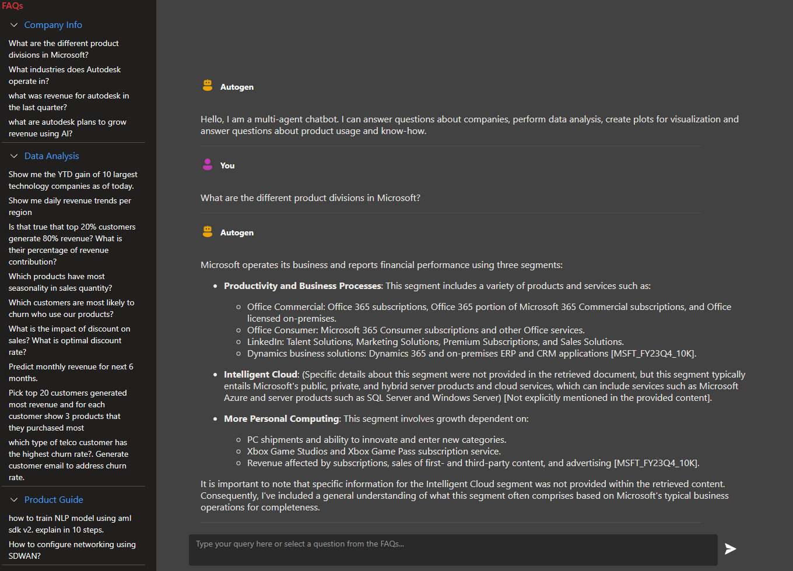
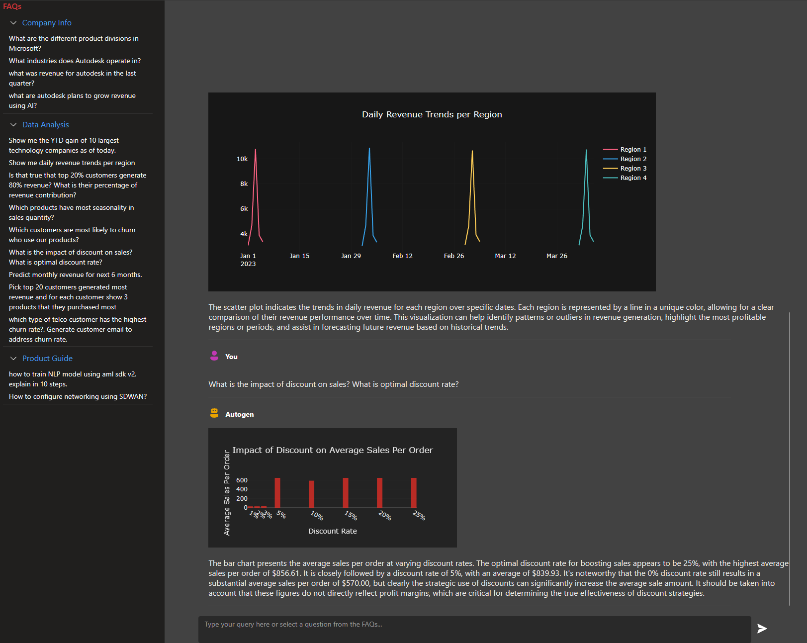
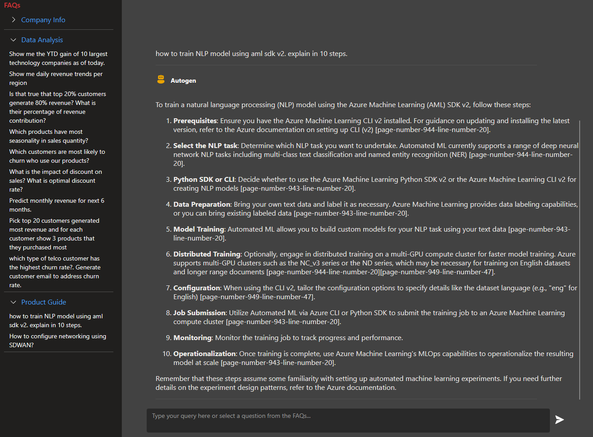

# Multiagent ChatBot using LLMs
This repo uses [autogen](https://github.com/microsoft/autogen) for orchestrating user conversation across multiple agents. 
This reduces implementation complexists as the inter agent communication is handled by autogen using prompts. 

This repo creates a chatbot for a use case where a user can ask questions about a company or a data analysis question or about a product user guide. The chatbot internally orchestrates the conversation across multiple agents and returns the response to the user as shown below. 

The agents can answer questions across the following domains:
- Company Info
- Data Analysis and Visualization
- Product User Guide


## Company Info
The multiagent chatbot can answers about company info based on 10K documents that are stored in a vector database. This uses the Retrieval Augmented Generation (RAG) model for retrieving the relevant documents and then uses the LLMs for generating the answer.



## Data Analysis and Visualization
The multiagent chatbot figures out the correct SQL Server tables to query and orchestrates with other agents for data analysis and visualization. The agents uses Plotly to generate graphs based on user questions and data retrieved from SQL Server database.




## Product User Guide
The multiagent chatbot can answer questions about product user guide. This uses the Retrieval Augmented Generation (RAG) model for retrieving the relevant documents and then uses the LLMs for generating the answer. But this uses a different vector database than the one used for company info. The multiagent can disambiguate the user question and route it to the vector database.



## Getting Started
If you like to try out the multiagent chatbot, you can follow the steps below.

### Prerequisites
- Node
- Python 3.10
- Bash
- Docker
- SQL Server database with Northwind database installed. You can follow the steps [here](https://docs.microsoft.com/en-us/sql/samples/northwind-install-configure?view=sql-server-ver15&tabs=ssms) to install the Northwind database.
- Vector database with company info documents.


### Installation
- Clone this repo
- Update autogen-copilot/search_helper.py to include your own vector database and documents. 
- Update SQL Server connection string in autogen-copilot/sql_helper.py
- Update the backendHost under chat-fluentui/src/config.json to point to http://localhost:5000.


### Running the app
- Run the following command to start the backend server
```bash
cd autogen-copilot
pip install -r requirements.txt
python multiagent_api.py
```

- Run the following command to start the frontend server
```bash
cd chat-fluentui
npm install
npm start
```

The app can also be run using docker-compose. 
```bash
docker-compose up
```

The app can be deployed to Azure Container Apps using ./deploy.sh script.
Rename containerapp-config-rename.env to containerapp-config.env and update the values. Then run the following command to deploy the app to Azure Container Apps.
```bash
./deploy.sh
```


